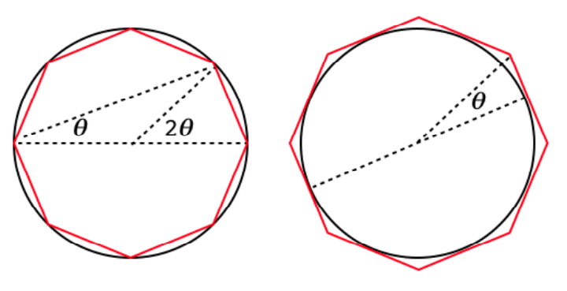

#### Pi

In this section, we will discuss Archimedes' method for approximating the value of $\pi$, the ratio of the circumference of a circle to its diameter.  

Archimedes' method is to measure the perimeter of paired inscribed and circumscribed polygons.  In particular, he came up with a way to compute the perimeter of a polygon of 2n sides, if the perimeter for an n-sided one is already known.




The famous result is 

> The ratio of the circumference of any circle to its diameter is less than 3 1/7 but greater than 3 10/71.

In decimal that's 

$3.140845.. < \pi < 3.1428571$

However, to focus on the bounds really misses the main idea, which is that Archimedes described an iterative procedure that can be used to calculate the value of $\pi$ to any desired accuracy</i>.  

He started with a hexagon ($6 \cdot 2^n$, with n = 0), and then doubled the number of sides four times ($6 \cdot 2^4 = 96$).  

Given the limitations of numerical calculation in Archimedes' time --- no decimal arithmetic, only fractions --- it is amazing that he went as far as he did, calculating bounds for $\pi$ in terms of two 96-sided polygons.

The argument is somewhat unwieldy in detail.  We give his exact proof.  (Note:  I have not read the original, nor the Heath translation).  But I have a trusted [source](https://itech.fgcu.edu/faculty/clindsey/mhf4404/archimedes/archimedes.html) to show me how.  

Later, we will also use modern trigonometry to achieve the same result more economically.  And to top it off, we go back to basic geometry to derive the same results by a different approach.

#### Preliminary theorems

As a preliminary, we have short write-ups for the various mathematical proofs required for the calculations.  The first two 

- [sum of angles](pdfs/Sum of angles.pdf)
- [double and half-angle formulas](pdfs/Double angle.pdf)

give us formulas for the trig functions of &theta;/2, given they are known for angle &theta;.  The last one is a classical result of Greek geometry

- [angle bisector](pdfs/Angle bisector.pdf)

which underpins Archimedes whole approach.  Not too surprising, it turns out that this result can be recast to give us the half-angle trig functions.

[Todo:  I will also have something to say about the various fractional manipulations and estimates for square roots.]

#### Outline

Here are the detailed calculations that retrace Archimedes' steps in computing upper and lower bounds on pi.

In the end, we will arrive at the famous expression:


$3 \ \frac{10}{71} < \pi < 3 \ \frac{1}{7}$

The first write-up is

- [original](pdfs/Archimedes orig.pdf)

It uses classic labels for the triangle sides as line segments like ``AO``, and gives ``AO:AC`` as such, rather than as cot &theta; and csc &theta;.

A revised version uses single letters (like ``f``) for the sides, and de-emphasizes the geometry, showing how to reduce the steps to a mechanical series of calculations of cotangent and cosecant.

- [revised](pdfs/Archimedes csc.pdf)

Third, the first of the modern approaches builds the argument for the sum of perimeters in terms of the sine and tangent of the half angle, i.e. the half-angle formulas.

- [Trigonometry](pdfs/Archimedes trig.pdf)


#### Gregory's formula

Two other sets of formulas reach the same end, one based on perimeters, and one on areas.  

These formulas are intriguing because they are so simple, and it's not surprising that they are closely connected.  In fact, when viewed in the right light, all of these formulas express the same basic approach. 

For example, consider a circle of unit <i>diameter</i>, so that &pi; is equal to the perimeter.  If ``p`` and ``P`` are the inside and outside perimeters for polygons whose sectors have central angle &theta;, and the same symbols are used with primes for angle &theta;/2, then:

```
P' = 2pP/(p + P)
1/P' = 1/2(1/p + 1/P)

p' = √(pP')
```

The corresponding formulas for inside ``a`` and outside ``A`` areas are (for a circle of unit radius)

```
A' = 2a'A/(a' + A)
a' = √(aA)
```

The perimeter gives the ratio to the diameter, since $\pi \times d = C$, where the circumference <i>C</i> is also called the perimeter.

The similar sets of formulas are subtly different.  

To go from ``p`` and ``P`` to the primed version, we start with the first formula, while for area we must start with the square root.

The formula $P' = 2pP/(p + P)$ is called the <i>harmonic mean</i>, while $p' = \sqrt{pP'}$ is called the geometric mean.

#### Perimeter and area:  derivation

In the first write-up we go from the half-angle formulas to the perimeter formulas.

- [Perimeter](pdfs/Perimeter geom.pdf)

The area is related to a circle of unit radius, since $\pi \times r^2 = A$.

Next we go from the half-angle formulas to the areaa formulas.

- [Area](pdfs/Area geom.pdf)

#### Geometry

In an alternative approach, we derive the formulas for perimeter and area from basic geometry.  The perimeter is first

- [Perimeter by geometry](pdfs/Geometry1.pdf)

and then the area:

- [Area by geometry](pdfs/Geometry2.pdf)

#### Area and perimeter calculations

Finally, here are some calculations to check the formulas obtained above.  The first script checks the perimeter and area formulas.

- [calculate1.py](src/calculate1.py)

<b>Output:</b>

```
> python calculate1.py
        perimeter
  0 2.828427  4.000000
  1 3.061467  3.313708
  2 3.121445  3.182598
  3 3.136548  3.151725
  4 3.140331  3.144118
  5 3.141277  3.142224

        area
  0 2.000000  4.000000
  1 2.828427  3.313708
  2 3.061467  3.182598
  3 3.121445  3.151725
  4 3.136548  3.144118
  5 3.140331  3.142224

>
```

#### Trig calculations

The second script tests the trig calculations.

- [calculate2.py](src/calculate2.py)

<b>Output:</b>

```
> python calculate2.py 
        trig
  4 2.828427  4.000000
  8 3.061467  3.313708
 16 3.121445  3.182598
 32 3.136548  3.151725
 64 3.140331  3.144118
128 3.141277  3.142224
>
```

But this is exactly the same as the perimeter calculation!

#### Hand calculation

It cannot be a coincidence that we get exactly the same values for ``P`` and ``A`` in the printouts above, round after round.  Those for ``p`` and ``a`` match as well, except there is an offset of one row.

It is difficult to do these calculations by hand because after a while there are inverses of inverses of inverses.

However, I carried out 3 half-steps for each method by hand, and it's absolutely clear, it is the same calculation.

See writeup:

[calculation](pdfs/Hand calc.pdf)

Below is a detailed breakdown of the calculations.  For each round, we must rename the primed variables to be the originals.

#### More by hand

<b>Perimeter</b>

- base case is a square
- perimeter of circle with d = 1
- rule: do ``P`` first then ``p``

formulas

```
P' = 2pP/(p + P)
p' = sqrt(pP')
```

initialization

```
P = 4
p = 2 sqrt(2)
```

To see the identity, let $x = P, y = p$, and follow the rules above:

```
x = 4
y = 2 sqrt(2)

1
x' = 2xy/(x+y)

2
y' = sqrt(x'y)

3
x = x'; y = y'
x' = 2xy/(x+y)
```

<hr>

<b>Area</b>

- base case is still a square
- area of circle with r = 1
- rule:  do ``a`` first then ``A``


formulas

```
a' = sqrt(aA)
A' = 2a'A(a'+A)
```

initialization

```
a = 2
A = 4
```

first step special for area

```
0
a' = sqrt(aA) 
   = 2 sqrt(2)
a = a'
```

Now, let $x = A, y = a$.  Note the switched order.

```
x = 4
y = 2 sqrt(2)

1
x' = 2xy/(x+y)

2
y' = sqrt(x'y)

3
x = x'; y = y'
x' = 2xy/(x+y)
```

It's exactly the same calculation!  The change in order of operations is seen to be due to the fact that we need a first step for the area, to convert ``a = 2`` to ``a = 2 sqrt(2)``.  The difference in formulas is harder to explain.
