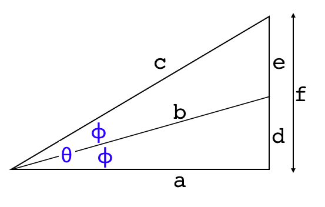

#### Pi

Archimedes is famous, among other things, for developing a very accurate estimate for the value of pi, the ratio of the circumference of a circle to its diameter.  

Archimedes method was to measure the perimeters of paired polygons having the same number of sides, one inscribed and the other circumscribed into a circle.  The ratio of these perimeters to the diameter of the circle provide upper and lower bounds on the value of pi.

The key was that Archimedes came up with a way to compute the perimeter of a polygon of 2n sides, if the perimeter for an n-sided one is already known.

He started with a hexagon (6 x 2^n, with n = 0), and then doubled the number of sides four times (6 x 2^4 = 96).

This figure shows octagons, which can also be used (as we will see).


The famous result is 

> The ratio of the circumference of any circle to its diameter is less than 3 1/7 but greater than 3 10/71.

In decimal that's 

``3.140845.. < pi < 3.1428571``

This is a very good estimate, the bounds differ from the true value by less than 1 part in 1000 for the lower one and less than 1.3 parts for the upper.

However, to focus on the bounds really misses the main idea, which is that Archimedes described an iterative procedure that can be used to calculate the value of pi to <i>any desired accuracy</i>.  

Given the limitations of numerical calculation in Archimedes' time --- no decimal arithmetic, only fractions --- it is amazing that he went as far as he did.

The argument is somewhat unwieldy in detail.  We give his exact proof, followed by a second, slightly friendlier version.  (Note:  I have not read the original, nor the Heath translation.  But I have a trusted [source](https://itech.fgcu.edu/faculty/clindsey/mhf4404/archimedes/archimedes.html) to guide me.)

Underpinning all the different results is the same fundamental idea which is shown in this diagram



If we know the three sides of the large triangle ``a, c`` and ``f``, and the triangle is bisected as shown, then it is possible (easy) to calculate the ratio ``a/d``.  That's the main step.  

``a/d`` is the cotangent of the half angle.  The ratio of the hypotenuse along the bisector ``b/d`` is the cosecant, and it follows from the Pythagorean theorem.

#### Preliminary theorems

As a preliminary, here are short write-ups for various mathematical proofs required for the calculations.  The first two are

- [sum of angles](pdfs/Sum of angles.pdf)
- [double and half-angle formulas](pdfs/Double angle.pdf)

These give us formulas for the trig functions of &theta;/2, given they are known for angle &theta;.  

They can be shown to be a consequence of the angle bisector theorem, which is a classical result of Greek geometry

- [angle bisector](pdfs/Angle bisector.pdf)
- [Euclid's proof](pdfs/Euclid angle bi.pdf)

This pair of theorems form the basis for Archimedes whole approach.  Not too surprising, it turns out that the classical result can be used to derive the half-angle trig functions.

Archimedes also relies on two approximations for the irrational number √3:  ``265/153`` and ``1350/780``.   √3 enters the picture as the cotangent of 30 degrees.

For more about how he did this this we need to know something about:

- [continued fractions](Square root of 3.pdf)

#### Quick look

Before we start, let's just look at calculating the perimeters for a square, hexagon and octagon.  The first two are easy, the last is more difficult.

- [quick](pdfs/Estimating pi.pdf)

#### Main results

Here are write-ups of the detailed calculations that show Archimedes' steps in computing upper and lower bounds on pi.

In the end, we will arrive at the famous expression:


```3 10/71 < pi < 3 1/7```

The first one is

- [original](pdfs/Archimedes orig.pdf)

It uses classic labels for the triangle sides as line segments like ``AO``, and gives ``AO:AC`` as such, rather than as cot &theta; and csc &theta;.

A revised version uses single letters (like ``f``) for the sides, and de-emphasizes the geometry, showing how to reduce the steps to a mechanical series of calculations of cotangent and cosecant.

- [revised](pdfs/Archimedes csc.pdf)

Then, the first of the modern approaches builds the argument for the sum of perimeters in terms of the sine and tangent of the half angle, i.e. the half-angle formulas.

- [trigonometry](pdfs/Archimedes trig.pdf)


#### Gregory's formula

Two other sets of formulas reach the same end, one based on perimeters, and one on areas.  

These formulas are intriguing because they are so simple, and nearly the same, with a twist.  It's not surprising that they are closely connected.  In fact, when viewed in the right light, all of these formulas express the same basic approach. 

Consider a circle of unit <i>diameter</i>, so that &pi; is equal to the perimeter.  If ``p`` and ``P`` are the inside and outside perimeters for polygons whose sectors have central angle &theta;, and the same symbols are used with primes for angle &theta;/2, then:

```
P' = 2pP/(p + P)
2/P' = 1/p + 1/P

p' = √(pP')
```

The corresponding formulas for inside ``a`` and outside ``A`` areas are (for a circle of unit radius)

```
2/A' = 1/a' + 1/A
a' = √(aA)
```

The perimeter gives the ratio to the diameter, since pi x d = C, where the circumference <i>C</i> is also called the perimeter.

The similar sets of formulas are subtly different.  

To go from ``p`` and ``P`` to the primed version, we start with the first formula, while for area we must start with the square root.

The formula P' = 2pP/(p + P) is called the <i>harmonic mean</i>, while p' = sqrt(pP') is called the geometric mean.

#### Perimeter and area:  derivation

First let's go from the half-angle formulas to the perimeter formulas.

- [Perimeter](pdfs/Perimeter geom.pdf)

The area is related to a circle of unit radius, since pi x r^2 = A.

Next, from the half-angle formulas to the area formulas.

- [Area](pdfs/Area geom.pdf)

#### Geometry

In yet one more alternative approach, we derive the formulas for perimeter and area from basic geometry.  The perimeter is first

- [Perimeter by geometry](pdfs/Perimeter geom.pdf)

and then the area:

- [Area by geometry](pdfs/Area geom.pdf)

#### Area and perimeter calculations

Finally, here are some calculations to check the formulas obtained above.  The first script checks the perimeter and area formulas.

- [calculate1.py](scripts/calculate1.py)

<b>Output:</b>

```
> python calculate1.py
        perimeter
  0 2.828427  4.000000
  1 3.061467  3.313708
  2 3.121445  3.182598
  3 3.136548  3.151725
  4 3.140331  3.144118
  5 3.141277  3.142224

        area
  0 2.000000  4.000000
  1 2.828427  3.313708
  2 3.061467  3.182598
  3 3.121445  3.151725
  4 3.136548  3.144118
  5 3.140331  3.142224

>
```

It cannot be a coincidence that we get exactly the same values for ``P`` and ``A`` in the printouts above, round after round.  Those for ``p`` and ``a`` match as well, except there is an offset of one row.

#### Trig calculations

The second script tests the trig calculations.

- [calculate2.py](scripts/calculate2.py)

<b>Output:</b>

```
> python calculate2.py 
        trig
  4 2.828427  4.000000
  8 3.061467  3.313708
 16 3.121445  3.182598
 32 3.136548  3.151725
 64 3.140331  3.144118
128 3.141277  3.142224
>
```

But this is exactly the same as the perimeter calculation!

```
> python calculate1.py
        perimeter
  0 2.828427  4.000000
  1 3.061467  3.313708
  2 3.121445  3.182598
  3 3.136548  3.151725
  4 3.140331  3.144118
  5 3.141277  3.142224
```

#### Calculation by hand

It is difficult to do these calculations by hand because after a while there are inverses of inverses of inverses.

However, I carried out 3 half-steps for each method by hand, and it's absolutely clear, it is the same calculation.

See the write-up for a detailed analysis.

[calculation](pdfs/Hand calc.pdf)
